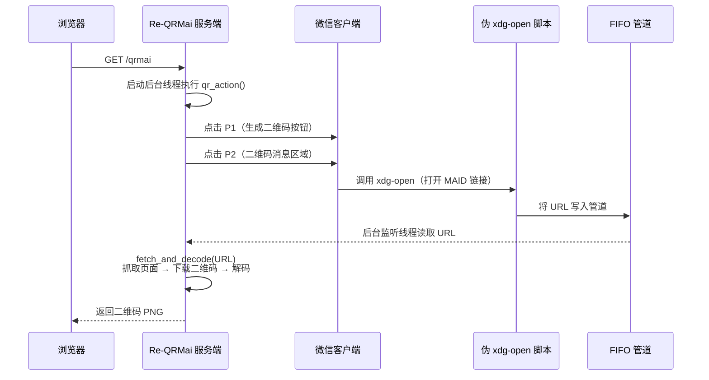
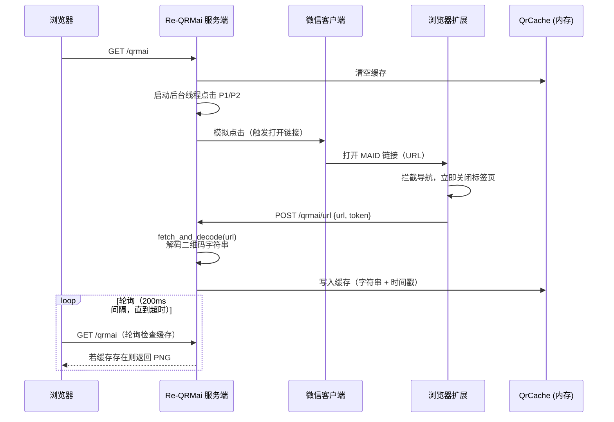

# Re-QRMai


夫二维码者，maimai 及中二音游登入之凭也。然华立以微信为取码之径，学子或设备无微信者，每苦其不便。Re-QRMai 者，以 Rust 重构旧器，化繁为简，一键取码，诚为利器。

---

## ✨ 特性

- **一键获取二维码**：打开浏览器访问 `/qrmai`，服务端自动模拟鼠标点击微信窗口，抓取二维码并直接显示在网页上。
- **两种捕获模式**：
  - **劫持模式（Linux 专属）**：通过伪装 `xdg-open` 截获微信打开的 MAID 链接，无需安装任何扩展。
  - **扩展模式（跨平台，Windows / macOS / Linux）**：配合浏览器扩展拦截链接（请求级取消，不加载页面），全平台通用。
- **零依赖运行**：单二进制文件，登录页、设置页、模板图片、样式、字体**全部编译进程序**，启动即用。
- **配置热更新**：通过浏览器设置页修改配置，实时生效，无需重启服务。
- **自动识别点击位置**：内置截图 + GPU 模板匹配，可自动定位微信窗口按钮位置，检测区随屏幕分辨率自适应。
- **首次启动随机令牌**：自动生成 `qrmaiXXXXXX` 格式的访问令牌，不再使用公开弱默认值。
- **检查更新**：设置页一键对比 GitHub 最新 release。

---

## 🚀 快速开始

### 1. 下载与运行

从 Releases 下载对应平台的二进制文件，或自行编译（见下文）。

解压后，在终端执行：

```bash
./Re-QRMai
```

首次运行会自动生成 `config.toml` 配置文件（**含中文说明注释**），并创建 `img/` 目录存放模板图片。**首次启动会随机生成访问令牌**（`qrmaiXXXXXX`，见 `config.toml` 的 `token` 字段）。

服务默认监听 `http://0.0.0.0:5000`，打开浏览器访问 `http://localhost:5000/login` 输入令牌即可登录。

> ⚠️ 若将服务暴露到局域网/公网，请务必确认 `config.toml` 中的 `token` 是随机值（旧配置若仍是 `qrmai` 请手动修改）。

### 2. 配置点击位置

有两种方式配置微信窗口中的按钮坐标：

- **自动识别**：访问设置页 `/settings`，点击「🔍 自动识别位置」，程序会截图并匹配模板，自动填入坐标。
- **手动填写**：在 `config.toml` 中修改 `p1`（生成二维码按钮）和 `p2`（二维码消息区域）的坐标，格式 `X,Y`。

默认模板图片位于 `img/p1.png` 和 `img/p2.png`，你也可以替换为 `img/p1_user.png` 和 `img/p2_user.png`（用户模板优先级更高）。

### 3. 选择捕获模式

- **Linux 用户**：默认使用劫持模式（`capture_mode = "hijack"`），最稳定，无需扩展。
- **其他平台**：默认使用扩展模式（`capture_mode = "extension"`），需要安装浏览器扩展。

#### 安装浏览器扩展（扩展模式）

- **Chrome / Edge**：加载 `extension/` 目录（启用开发者模式）。
- **Firefox**：临时加载 `extension/manifest.firefox.json` 或打包为 `.xpi` 安装。

扩展会自动拦截 MAID 链接（请求发出前即取消）并转发给服务端，你只需在扩展配置页中设置服务端地址（默认 `http://127.0.0.1:5000`）和令牌（token）。

> 修改 `port` / `qr_route` 后需同步扩展配置页。

---

## ⚙️ 配置说明

配置文件 `config.toml` 位于程序根目录（首次启动自动生成，含注释即文档）。常用项如下：

| 配置项 | 默认值 | 说明 |
|---|---|---|
| `token` | 随机生成 | 管理面板登录令牌，同时也是扩展提交的验证令牌（`qrmaiXXXXXX`） |
| `p1` / `p2` | 示例坐标 | 微信窗口中「生成二维码」按钮和二维码消息区域的点击位置 |
| `host` / `port` | 0.0.0.0 / 5000 | 服务监听地址 |
| `qr_route` | /qrmai | 二维码页面的路由 |
| `capture_mode` | Linux: hijack / 其他: extension | 捕获模式 |
| `wechat_bin` | /opt/wechat/wechat | Linux 下微信可执行文件路径（劫持模式） |
| `wechat_url_timeout` | 5 | 等待微信 URL 的超时时间（秒），扩展模式自动放宽到 ≥15s |
| `template_threshold` | 0.8 | 模板匹配置信度阈值（识别不到可调低） |
| `p2_region_ratio_x/y` | 0.2 / 0.2 | P2 检测区 = 屏幕宽/高 × 比例（自动适配分辨率） |

其他高级配置（皮肤、独立模式等）请参考配置文件中的注释。

---

## 📈 工作流程

> ⚠️ 剧透警告：以下内容涉及大量鼠标模拟和系统欺骗，心脏病患者请在大佬陪同下观看。

### 劫持模式（Linux）



### 扩展模式（跨平台）



---

## 🛠 开发与构建

### 依赖

- Rust 工具链（edition 2024）
- Linux 额外依赖（仅劫持模式）：`dbus-run-session`、`xdg-open`（系统自带）

### 编译

```bash
# Debug 构建
cargo build

# Release 构建（体积优化）
cargo build --release
```

### 打包发布（使用 Nushell）

```bash
nu build.nu all   # 构建二进制 + 浏览器扩展 + 发布包
```

产物位于 `dist/` 目录（二进制、双扩展 zip、完整 tar.gz）。

### 修改 UI 样式

样式使用 Tailwind CSS v4（CSS-first 配置，见 `static/input.css`），改动模板类名后重新编译：

```bash
tailwindcss -i static/input.css -o static/tailwind.css --minify
```

---

## 💀 翻车指南（常见问题）

**Q：为什么需要模拟鼠标点击？**
A：因为微信客户端本身不提供 API 获取二维码，只能用模拟操作触发其打开链接的行为。说白了就是帮你在屏幕上点两下，只不过是用代码点的。

**Q：劫持模式只能 Linux 用？**
A：是的，因为依赖 Linux 特有的 `xdg-open` 拦截机制。其他平台请使用扩展模式，别抱怨，Linux 用户好不容易有个专属福利。

**Q：扩展模式需要每次都安装扩展吗？**
A：只需要安装一次，后续扩展会自动运行。记得在扩展设置中正确填写服务端地址和令牌，不然它不知道该把 URL 发给谁。

**Q：配置变更需要重启服务吗？**
A：不需要，在 `/settings` 页面保存后立即生效。如果没生效……刷新一下页面，还不行就重启服务，还不行就重启电脑，再不行就重启人生。

**Q：点错位置了怎么办？**
A：坐标不对。去 `/settings` 重新识别，或者自己拿尺子量屏幕像素（不推荐）。如果自动识别也识别不准，试试调整 `template_threshold` 阈值。

**Q：微信没反应？**
A：先确认微信窗口是打开且可见的，不是最小化，不是后台挂起。你人在机台前总得把微信亮出来吧？另外检查 `wechat_bin` 路径是否正确。

**Q：扩展模式收不到 URL？**
A：检查扩展装没装、服务开没开、token 对不对、防火墙拦没拦。按顺序排查，如果都对了还是收不到……可能是你脸黑，多试几次。

**Q：扫码失败怎么办？**
A：二维码可能有有效期，过期了重新请求就好。如果持续失败，检查网络能否访问 `wq.wahlap.net`，或者微信是不是又偷偷改了页面结构。

**Q：登录令牌是什么？**
A：首次启动自动生成的随机值（`qrmaiXXXXXX`），在 `config.toml` 的 `token` 字段。忘记的话看一眼配置文件，或删除 `config.toml` 重启让程序重新生成（会重置所有配置）。

**Q：我能把这个部署到学校机房吗？**
A：理论上可以，但机房老师可能会问你为什么在服务器上养了个微信。祝你好运。

---

## 📄 许可证

本项目采用 [MIT](LICENSE) 许可证。

---

## 🙏 致谢

- 原版 QRMai（Python 实现）的创意与基础代码。
- 所有优秀的 Rust 库贡献者。

---

如遇问题，欢迎提交 Issue 或 Pull Request。祝你使用愉快！
